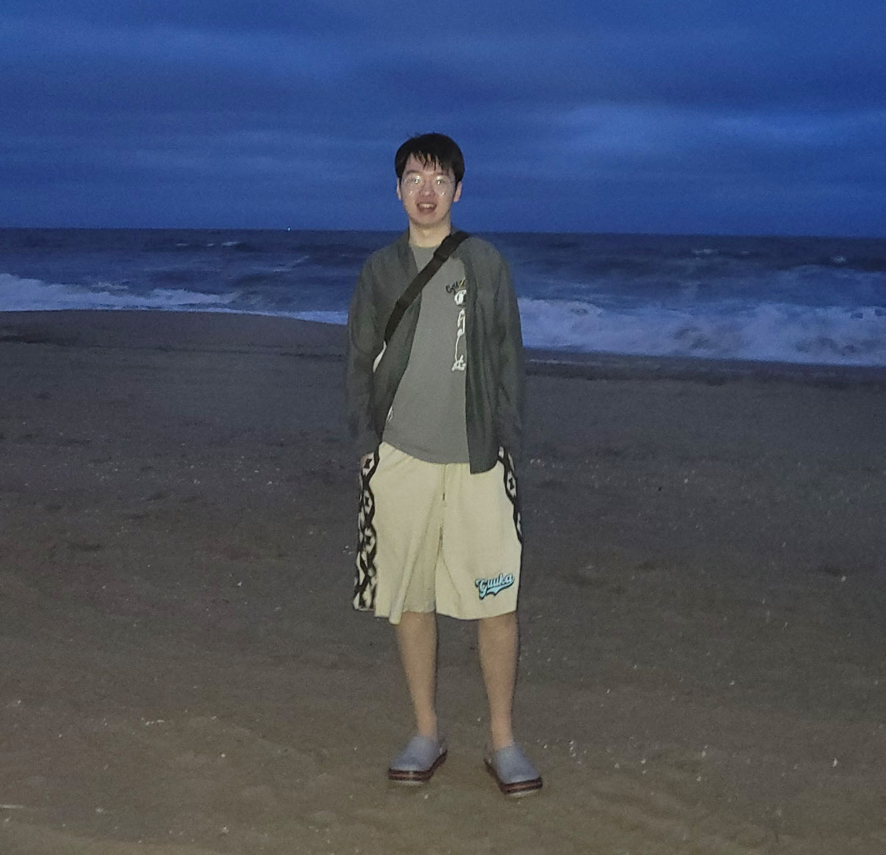

# About Me

<!--  -->

Here is **Licheng Luo (罗立城)**.
I am a master student in **Computer Science** at University of Virginia where I am fortunately advised by Prof. [Shangtong Zhang](https://shangtongzhang.github.io/). Prior to this, I obtained my bachelor's degree in Electronic Engineering from Huazhong University of Science and Technology, where I luckily advised by Prof. [Xin Yang](https://sites.google.com/view/xinyang/home). You can find my CV [here](https://tiejin98.github.io/file/Tiejin_CV_031224.pdf).

 

## Academic Background

**[Highlight] I am looking for PhD to start in 2025 Spring/Fall. Contact me if you have any leads!**

- **Aug 2023 - January 2025:** University of Virginia (MSCS)
- **Sep 2019 - June 2023:** Huazhong University of Science and Technology (BSEE)

 

---

## Research Interests

- Robust Reinforcement Learning
- Bi-level Optimization and Analysis
- Applications of Reinforcement Learning

 

---

<!-- ## News and Updates

- **Aug 2023：**Exicted to .
- If you are interested in my works, please feel free to book an [[online talk with me](https://calendly.com/lancecai/meet-with-lance)]. -->
